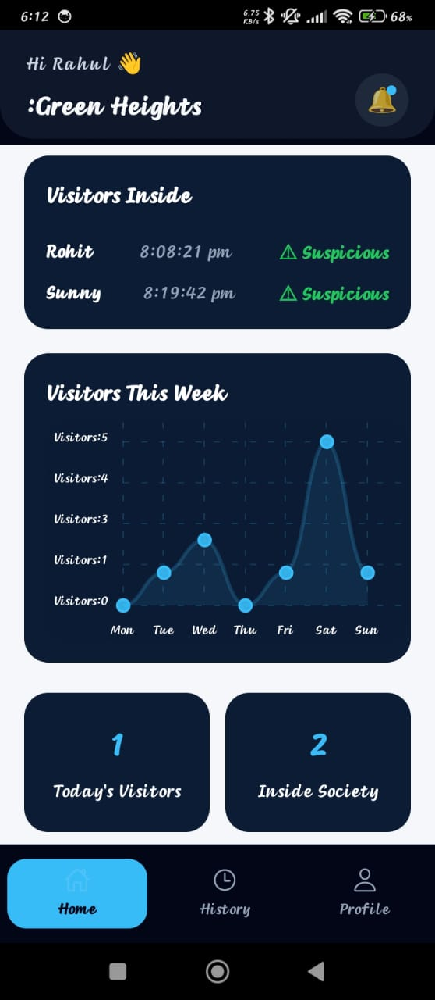
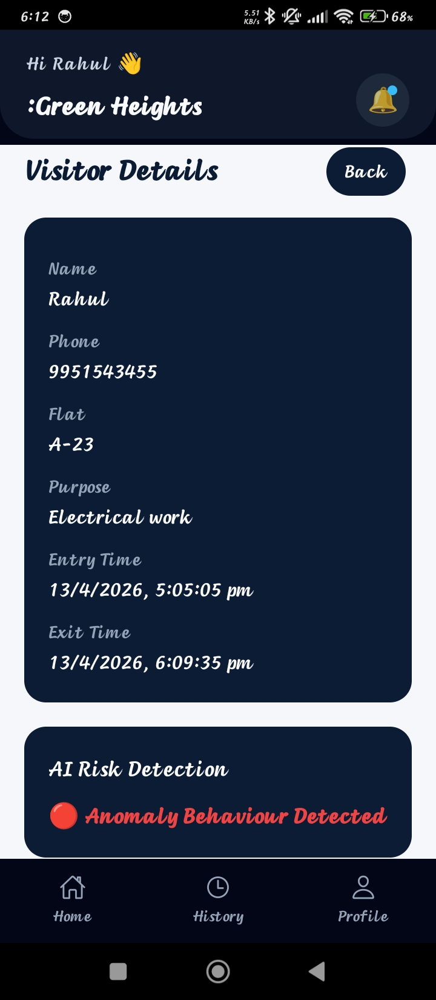
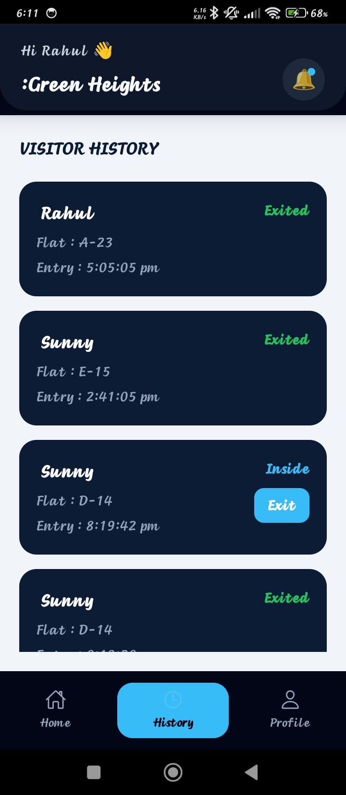
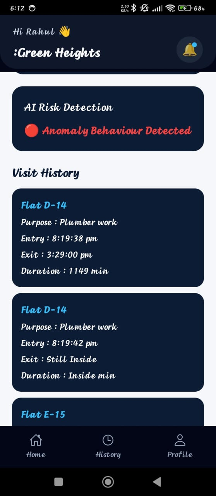

🛡️ SocietyPay + Smart Security System

AI-Powered Society Management + Visitor Intelligence 🚀

 "React Native" (https://img.shields.io/badge/React_Native-20232A?style=for-the-badge&logo=react&logoColor=61DAFB)
"Node.js" (https://img.shields.io/badge/Node.js-43853D?style=for-the-badge&logo=node.js)
"MongoDB" (https://img.shields.io/badge/MongoDB-4EA94B?style=for-the-badge&logo=mongodb)
"Python" (https://img.shields.io/badge/Python-3776AB?style=for-the-badge&logo=python)
"FastAPI" (https://img.shields.io/badge/FastAPI-005571?style=for-the-badge&logo=fastapi)

---

🧠 Project Overview

This is a full-stack intelligent society management system that combines:

- 💳 Payments (Razorpay)
- 🧠 AI-based decision systems
- 🛡️ Smart security monitoring
- 📊 Real-time analytics

---

🔥 NEW: Smart Security System (Highlight Feature 🚨)

This module brings AI-powered visitor monitoring into societies.

💡 What it does:

- Tracks every visitor entry & exit
- Monitors live visitors currently inside
- Detects anomaly behavior using ML
- Updates behavior every 10 minutes automatically
- Shows risk level: Normal / Suspicious

---

📊 Visitor Intelligence Features

🔍 Real-Time Tracking

- Shows who is currently inside
- Displays:
  - 👤 Name
  - ⏱ Entry Time
  - ⌛ Duration inside
  - ⚠️ Behavior

---

🧠 AI Behavior Detection

ML model uses:

- Visit frequency
- Entry timing
- Stay duration
- Number of flats visited

➡️ Output:

- ✅ Normal
- ⚠️ Suspicious

---

🔄 Auto Refresh System

- Backend updates behavior every 10 minutes
- Frontend auto-refresh using "setInterval"
- Ensures real-time monitoring

---

📜 Visitor History System

- Stores all visits
- Shows:
  - Previous visits
  - Flats visited
  - Duration trends

---

📷 Security Module Screenshots

🏠 Security Dashboard

---

👤 Visitor Detailed View

---

📜 Visitor History

---

🔍 In-depth Visitor Analysis

---

👮 Security Profile

---

🏗 System Architecture

📱 React Native App
        ↓
🌐 Node.js Backend (Express)
        ↓
🗄 MongoDB Database
        ↓
🤖 Python ML Service (FastAPI)

---

⚙️ Tech Stack

📱 Frontend

- React Native
- TypeScript
- Chart Kit

🌐 Backend

- Node.js
- Express.js
- MongoDB (Mongoose)

🤖 AI

- Python
- FastAPI
- Custom anomaly detection logic

---

🔌 Key APIs

Visitor APIs

- "POST /visitor/add"
- "PUT /visitor/exit/:id"
- "GET /visitor/history"

Security APIs

- "GET /insidevisitors"
- "GET /visitorstats"
- "GET /detect-visitor-risk" (auto update)

---

⚠️ Challenges Solved

❌ Graph Crash (NaN Error)

✔ Fixed using data sanitization

❌ Real-time updates

✔ Solved with interval-based fetching

❌ ML data inconsistency

✔ Feature engineering + normalization

---

🚀 Future Enhancements

- 🔔 Push notification for suspicious visitors
- 📸 Face recognition
- 📍 GPS tracking
- 🧠 Deep learning model

---

👨‍💻 Author

Rohit Jadhav
🎓 NIT Silchar
💻 Full Stack Developer | ML Enthusiast

---

⭐ Star this repo if you found it useful
🔥 This project combines Full Stack + AI — built for real-world impact

