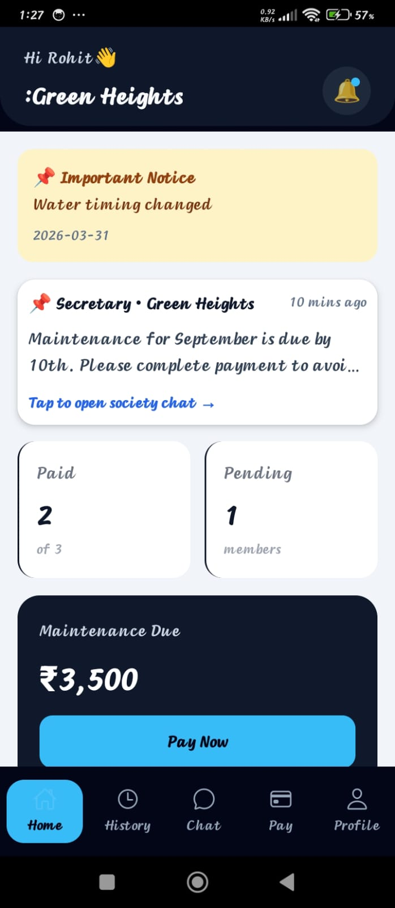
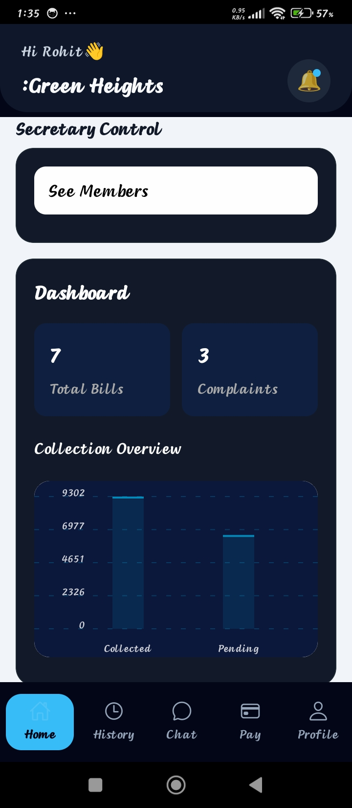
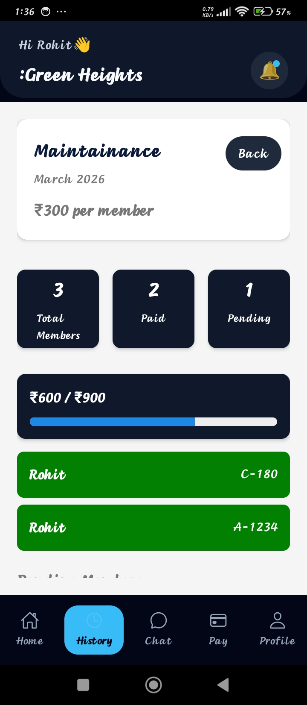
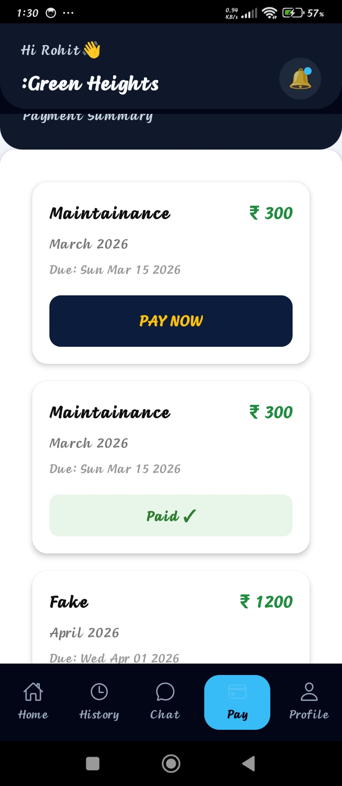
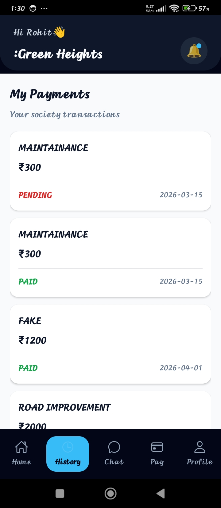
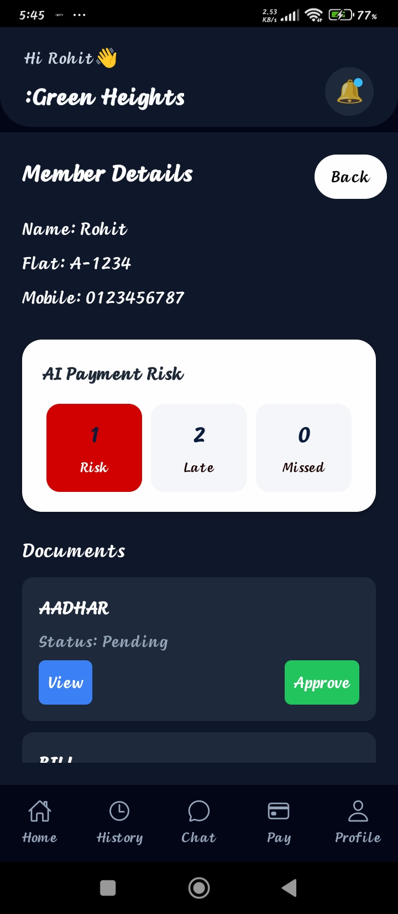
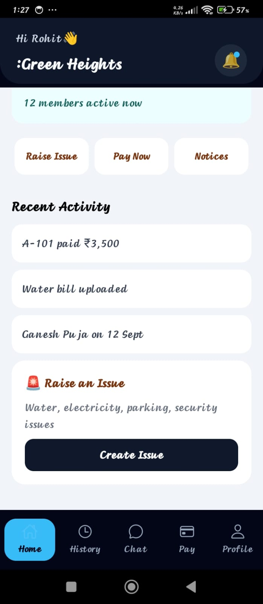
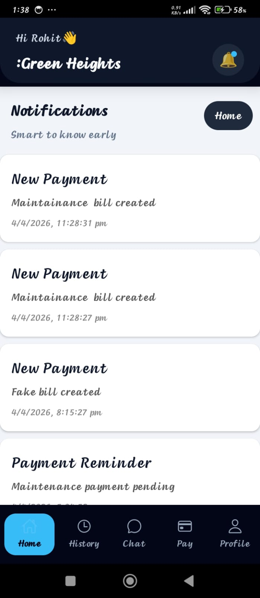

<div align="center">


<br/>

[](https://reactnative.dev/)
[](https://typescriptlang.org/)
[](https://nodejs.org/)
[](https://mongodb.com/)
[](https://python.org/)
[](https://fastapi.tiangolo.com/)
[](https://razorpay.com/)

<br/>

> **SocietyPay** is a full-stack mobile platform that brings AI to residential society management —
> automating payments, predicting defaulters, and intelligently routing complaints using NLP.

<br/>

[📱 Features](#-features) • [🤖 AI Services](#-ai-services) • [🏗 Architecture](#-architecture) • [📷 Screenshots](#-screenshots) • [⚙ Setup](#-installation) • [🔮 Roadmap](#-roadmap)

</div>

---

## 💡 The Problem

Managing a residential society is painful:

- 🔴 Maintenance payments are delayed and hard to track
- 🔴 Complaints pile up with no priority or routing
- 🔴 Secretaries have no visibility into who is likely to default
- 🔴 Communication between residents and management is scattered

**SocietyPay solves all of this in one AI-powered mobile app.**

---

## ✨ Features

| Module | What it does |
|--------|-------------|
| 💳 **Smart Payments** | Secretary generates bills · Members pay via Razorpay · Auto-verification |
| 🤖 **AI Risk Prediction** | ML flags members likely to default before it happens |
| 🧠 **NLP Complaints** | Auto-categorizes, prioritizes & routes complaints to the right person |
| 📊 **Secretary Dashboard** | Live overview — collections, pending, risky members |
| 🧾 **Bill Overview** | Itemized billing history for every flat |
| 📢 **Communication Hub** | Announcements, notifications, resident updates |
| 👤 **Member Profiles** | Documents, payment history, AI risk score per member |

---

## 🤖 AI Services

### 🔴 Payment Risk Prediction
A dedicated Python microservice studies each member's payment behavior and classifies them into risk categories — so the secretary can act **before** a default happens.

```
Inputs  ──▶  Late payments · Missed payments · Payment frequency
Output  ──▶  🟢 Low Risk  |  🟡 Medium Risk  |  🔴 High Risk
Stack   ──▶  Python · FastAPI · Scikit-learn
```

---

### 🧠 NLP Complaint Prioritization
Residents type complaints in plain language. The ML model reads it, understands it, and handles the rest — no manual sorting needed.

```
"Water leaking badly from bathroom pipe"
                    │
          ┌─────────▼──────────┐
          │   NLP Classifier   │
          │   (Naive Bayes)    │
          └─────────┬──────────┘
                    │
       ┌────────────┼─────────────┐
       ▼            ▼             ▼
  Category:     Priority:     Route to:
  Plumbing    🔴 High        Plumber
```

**Live Examples:**

| Complaint | Category | Priority | Assigned To |
|-----------|----------|----------|-------------|
| Water leaking from bathroom | Plumbing | 🔴 High | Plumber |
| Lift making unusual noise | Maintenance | 🟡 Medium | Technician |
| Corridor light not working | Electrical | 🟢 Low | Electrician |
| Garbage not collected | Cleaning | 🟡 Medium | Housekeeping |

---

## 🏗 Architecture

```
┌─────────────────────────────────────┐
│     React Native App (TypeScript)   │
└──────────────┬──────────────────────┘
               │ REST API · JWT Auth
               ▼
┌─────────────────────────────────────┐
│      Node.js / Express Backend      │
│                                     │
│  ┌──────────────┐                   │
│  │   MongoDB    │  ← Mongoose ODM   │
│  └──────────────┘                   │
│                                     │
│  ┌──────────────────────────────┐   │
│  │   Python AI Microservice     │   │
│  │         (FastAPI)            │   │
│  │                              │   │
│  │  ┌─────────────────────┐    │   │
│  │  │ Payment Risk Model  │    │   │
│  │  │   (Scikit-learn)    │    │   │
│  │  └─────────────────────┘    │   │
│  │                              │   │
│  │  ┌─────────────────────┐    │   │
│  │  │  NLP Complaint      │    │   │
│  │  │  Classifier         │    │   │
│  │  │  (Naive Bayes)      │    │   │
│  │  └─────────────────────┘    │   │
│  └──────────────────────────────┘   │
└─────────────────────────────────────┘
```

---

## 🛠 Tech Stack

```
📱 Mobile        →  React Native · TypeScript
🖥  Backend       →  Node.js · Express.js · JWT
🗄  Database      →  MongoDB · Mongoose
💳 Payments      →  Razorpay API
🤖 AI / ML       →  Python · FastAPI · Scikit-learn
🧠 NLP           →  Naive Bayes · CountVectorizer
```

---

## 📷 Screenshots

### 🏠 Home & Dashboard
| Home Screen | Secretary Dashboard | Bill Overview |
|:-----------:|:------------------:|:-------------:|
|  |  |  |

### 💳 Payments & History
| Pay Screen | Payment History |
|:----------:|:--------------:|
|  |  |

### 🤖 AI Features
| AI Risk Analysis | Complaint System |
|:---------------:|:---------------:|
|  |  |

### 📢 Communication
| Notifications | Announcements | Communication Hub |
|:------------:|:-------------:|:-----------------:|
|  |  |  |

---

## 🎥 Demo Videos

| Payment Flow | AI Complaint Risk |
|:-----------:|:-----------------:|
| [▶ Watch Payment Demo](ScreenShots/Payment.mp4) | [▶ Watch AI Demo](ScreenShots/ComplaintRisk.mp4) |

---

## ⚙ Installation

### Prerequisites
- Node.js ≥ 18
- Python ≥ 3.10
- Android Studio / Xcode
- MongoDB running locally or Atlas URI

### 1. Clone
```bash
git clone https://github.com/rohitjadhav8849/SocietyPay.git
cd SocietyPay
```

### 2. Backend
```bash
cd Backend
npm install
# Add your .env (MongoDB URI, JWT Secret, Razorpay keys)
npm run dev
```

### 3. Mobile App
```bash
cd NewSocietyPay
npm install
npx react-native run-android
```

### 4. AI Microservice
```bash
cd AI-service
pip install -r requirements.txt
python main.py
```

---

## 🔮 Roadmap

- [x] Smart payment system with Razorpay
- [x] AI payment risk prediction
- [x] NLP complaint categorization & routing
- [x] Secretary dashboard
- [x] Communication hub
- [ ] **Visitor anomaly detection** (Isolation Forest — Unsupervised ML)
- [ ] Real-time society chat
- [ ] AI payment reminder bot
- [ ] Smart maintenance prediction

---

## 👨‍💻 Author

<div align="center">

**Rohit Jadhav**
*NIT Silchar · Full Stack Developer · AI Enthusiast*

[](https://linkedin.com/in/your-profile)
[](https://github.com/rohitjadhav8849)

</div>

---

<div align="center">

**⭐ Star this repo if you found it useful — it motivates me to keep building! 🚀**

*Built with ❤️ at NIT Silchar*

</div>